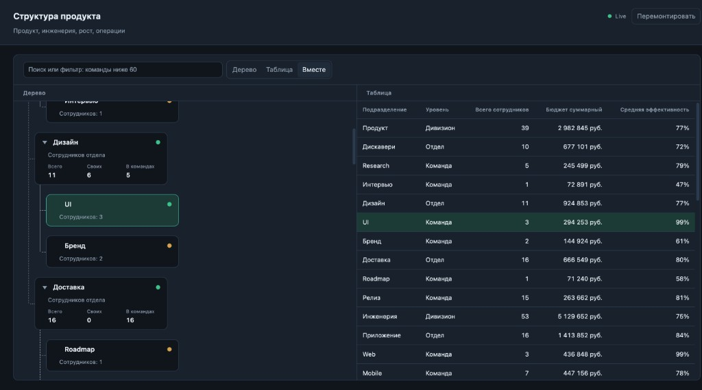
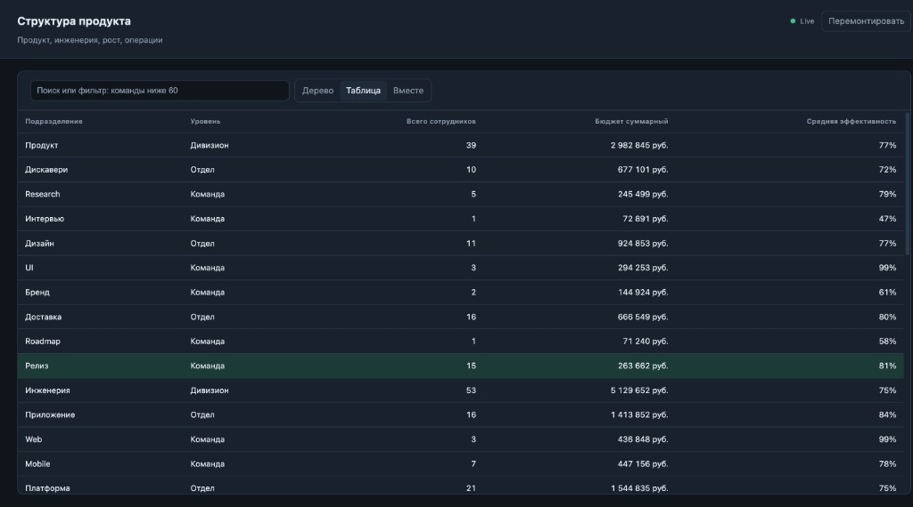
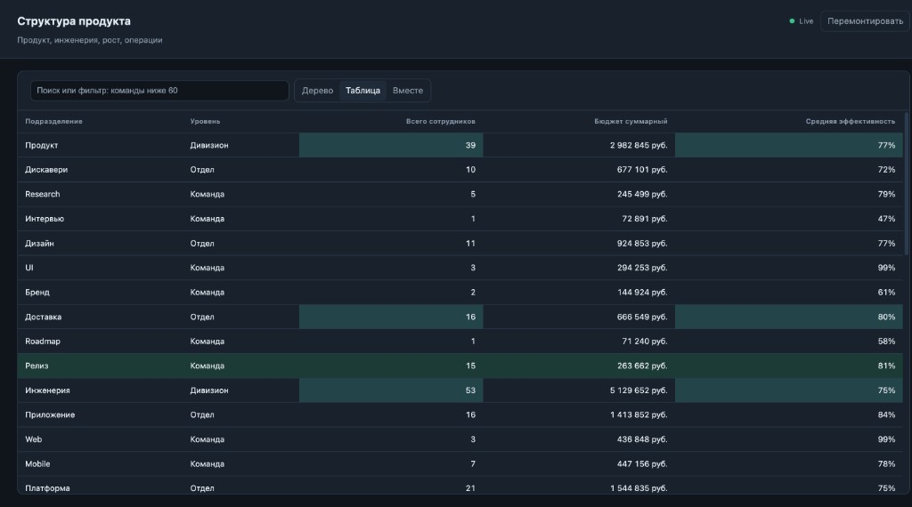

# OrgTree

Дашборд мониторинга орг-структуры.

## Интерфейс

Split-view (≥1280px, вид «Вместе»): дерево и таблица рядом, общее выделение.



Таблица на всю панель.



Подсветка ячеек при live-обновлениях.



## Запуск

### Development

```bash
cp .env.example .env
npm i
npm run dev
```

Клиент: http://localhost:5173  
API: http://127.0.0.1:3001/api/org-tree

Конфиг — `.env`: `SERVER_PORT`, `SERVER_HOST`, интервал мутатора.

### Docker

В ТЗ требование docker-compose, но это старый бинарь, его больше не ставят.Как запустить:

**Docker Compose version v5.5.1**

```bash
cp .env.example .env
docker compose up --build
```

Клиент и API на одном origin: http://localhost:8080 (`CLIENT_PORT`).  
`/api/org-tree` и SSE `/api/org-tree/stream` проксирует nginx на сервер. Gzip включён.
**Продакшн сборка 117kb**. (gzip -c dist/assets/*.js | wc -c –> 116737)

### Запуск тестов:

```bash
npm test
```

Инварианты схемы, взвешенной агрегации и фикстуры (≥40 узлов, ≥3 уровня).

Query на странице клиента проксируется в `GET /api/org-tree` как есть.
Они используются для проверки сценариев.
Параметры можно комбинировать, например `?scenario=empty&delay=1500`.

## Карточки дерева

Суммы включают **узел и всех потомков**.
Эффективность — **взвешенная по headcount** (свой headcount входит в вес.
Индикатор эффективности команды: 0–40 / 41–70 / 71–100.
Точное значение — в tooltip.

- Родитель: Всего / Своих / В отделах или В командах.
- Лист: `Сотрудников: n`.
- По умолчанию открыт второй уровень (отделы).

## Таблица

Строка = узел + агрегат (узел и все потомки, эффективность взвешена по headcount). Переключение вида **не** делает GET.

- Переключатель «Дерево / Таблица» всегда в шапке панели. Если ширина панели ≥1280px, появляется «Вместе» и по умолчанию дерево с таблицей стоят рядом.
- Колонки: Подразделение, Уровень, Всего сотрудников, Бюджет суммарный, Средняя эффективность.
- Клик по заголовку — сортировка по возрастанию, повторный клик по той же стрелке снимает сортировку. Двойной клик — по убыванию, повторный двойной тоже снимает.
- Фильтр по названию: substring, без учёта регистра, debounce 250 мс.
- Клик по строке выделяет узел в дереве (предки раскрываются). Клик по карточке выбирает строку; шеврон только раскрывает ветку.
- Escape или клик вне строки/карточки снимает выделение.
- Клавиатура (фокус на таблице): ↑/↓ — курсор на соседнюю строку (без выделения), Home/End — первая/последняя, Enter — выделить строку, как клик.

## Примеры NL фильтров

- бюджет больше миллиона
- команды сотрудниками больше 5 и меньше 10
- команды с эффективностью ниже 60

## Проверка GET-параметров

| Параметр           | Пример                                  | Ожидание                                               |
| ------------------ | --------------------------------------- | ------------------------------------------------------ |
| _(нет)_            | http://localhost:5173/                  | 40 узлов, 3 уровня; отделы раскрыты                    |
| `delay`            | http://localhost:5173/?delay=2000       | скелетон «Загрузка дерева», затем данные; max 10000 мс |
| `scenario=empty`   | http://localhost:5173/?scenario=empty   | пустой валидный ответ, не ошибка                       |
| `scenario=invalid` | http://localhost:5173/?scenario=invalid | ошибка схемы zod + кнопка «Повторить»                  |
| `status`           | http://localhost:5173/?status=500       | ошибка HTTP + «Повторить»                              |

Прямые запросы к mock API:

```
http://127.0.0.1:3001/api/org-tree
http://127.0.0.1:3001/api/org-tree?delay=2000
http://127.0.0.1:3001/api/org-tree?scenario=empty
http://127.0.0.1:3001/api/org-tree?scenario=invalid
http://127.0.0.1:3001/api/org-tree?status=500
```

Кнопка **Перемонтировать** в шапке снимает подписку store (abort) и подписывается снова: при возрасте кэша < 5с в Network не должно быть нового `org-tree`. После 5с — фоовый GET, дерево не пропадает.

Ключ кэша — payload, не URL целиком. `delay` в ключ не входит: `/` и `/?delay=2000` делят один snapshot (если он уже свежий, скелетона на delay не будет).
`scenario` и `status` (4xx/5xx) — другие ключи: переход `/` → `/?scenario=empty` и «Перемонтировать» сразу запросит empty, не покажет старое дерево.

## AI в разработке

Инструменты: Cursor (Grok 4.6), точечно Copilot.
Я обычно делаю все это в несколько этапов, сначала планирование, потом проверка по лучшим практикам и обсуждение альтернатив, плюсов и минусов с гроком, он в этом хорош.

### Генерировал

- Обсудил архитектуру с грок/курсор, что выходило за рамки ТЗ упростил и частично переписал формулировки, убрал лишнее, уточнил инварианты, сформировал документацию с архитектурой, моделью данных, ADR.
- До интерфейса - zod-схему узла и типы, фикстуры, unit-тесты на корректный парсинг типов, аггрегацию и тесты на нее.
- scaffold Vite + TS, черновик docker-compose / nginx
- первый черновик styled-компонентов дерева
- таблицу примеров для NL-парсера
- Каркас аналитической таблицы и лейаута дерево/таблица/дерево+таблица.
- Сортировку: клик, двойой клик.

### Перенёс почти без правок

- nginx gzip + proxy `/api`
- шаблон ADR

### Что проверял и писал сам

- Отревьювил по слоям, убедился что в src/ui, src/app нет походов в сеть, это только в слое http.
- Проверил отстутствие инлайн стилей.
- Вручную оттестировал критически точки: соблюдение инвариантов, кеш, дедупликация запросов.
- Курсор пропустил динамические применения фильтра при патче через SSE. Поправил, чтобы фильтр применялся динамически.
- В ТЗ не описано, но надо уметь сбрасывать сортировку.
- Сохранил выбранный вью в локалсторадже, чтобы человек мог работать с выбраным форматом не переключая каждый раз.
- В ТЗ в разделе что сдавать написано “контракт WebSocket-патча”, в ADR объясняю, почему выбрал SSE.
- Для пустого состояия пока сделал заголовок и кнопку обновить.
  По хорошему тут можно прикрутить разумный полинг и интерфейс пустой таблицы. (Очевидно, что структура предприятий не меняется с такой частотой, тут это все избыточо, но архитектуру этой таблицы можно переложить на проект с частыми обновлениями, в сервере же лежит мутатор, который эмулирует именно это).

Всегда в конце прошу курсор еще раз отстмотреть код на предмет потенциальных багов и еще раз прохожусь по диффу. Тут, например, поймал таким образом Date.parse вместо строгого ISO. Было валидно January 1, 2026, не только 2026-09-15T12:00:00.000Z, починил и покрыл тестами.
