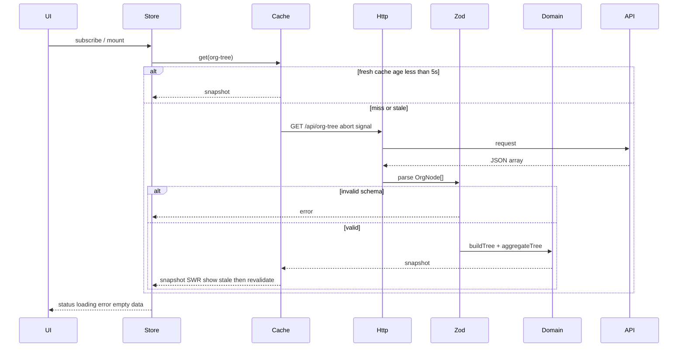
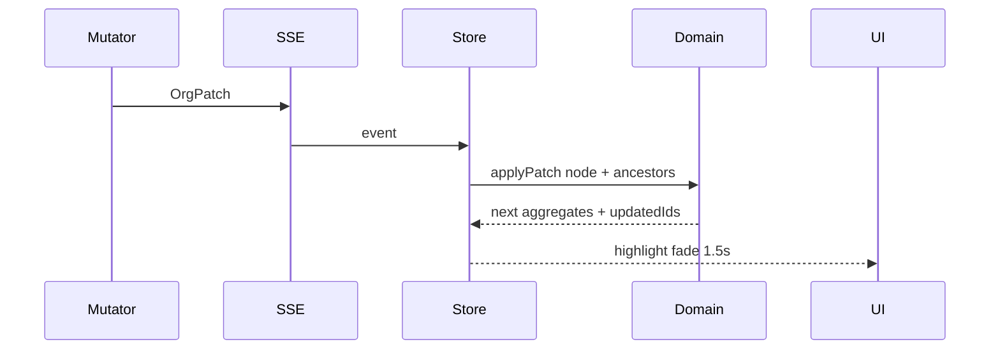

# Architecture

Org-tree dashboard: иерархический мониторинг орг-структуры (дивизионы → отделы → команды) с интерактивным деревом, аналитической таблицей и live-патчами.

Документ описывает слои и поток данных.

## Принципы

1. UI не ходит в сеть. Компоненты читают store, не `fetch`.
2. Домен — чистый TypeScript.
3. Кэш инвалидируется только при реальном изменении данных (патч или явный refresh), не при смене вида Tree/Table.
4. Один snapshot → один полный проход агрегации. Дальше — инкремент по предкам.
5. Bundle-бюджет production: JS ≤ 200 КБ gzip.

Связанные решения: [ADR 001](adr/001-swr-cache-layer.md), [ADR 002](adr/002-sse-over-websocket.md), [ADR 003](adr/003-incremental-aggregation.md), [ADR 004](adr/004-nl-search.md). Модель данных: [data-model.md](data-model.md).

## Слои

```
┌─────────────────────────────────────────────────────────┐
│  UI          src/ui  src/app                            │
│              дерево, таблица, шапка, поиск, view-mode   │
├─────────────────────────────────────────────────────────┤
│  Application src/data/store                             │
│              OrgTreeStore + useSyncExternalStore        │
├─────────────────────────────────────────────────────────┤
│  Domain      src/domain                                 │
│              schema, tree, aggregate, applyPatch        │
├─────────────────────────────────────────────────────────┤
│  Data        src/data                                   │
│              http + zod, SWR cache, SSE + backoff       │
├─────────────────────────────────────────────────────────┤
│  Server      server                                     │
│              GET /api/org-tree, GET /api/org-tree/stream│
└─────────────────────────────────────────────────────────┘
```

Зависимости только вниз: `ui → store → domain | data`. `domain` не импортирует React и HTTP.

## Каталоги (целевые)

```
src/
  domain/          # типы, zod, buildTree, aggregateTree, applyPatch
  data/            # http, cache, sse, store
  ui/              # styled-components, без inline-CSS
  app/             # композиция, breakpoint split-view
server/            # mock API, генератор ≥40 узлов, мутатор, SSE
docs/              # этот файл, data-model, adr/
```

## Поток данных: первая загрузка



Состояния ответа:

| Состояние | Условие                                      | UI                         |
| --------- | -------------------------------------------- | -------------------------- |
| `loading` | нет snapshot и запрос в полёте               | скелетон, без дерева       |
| `error`   | сеть, abort не из-за unmount, или zod failed | сообщение + retry          |
| `empty`   | валидный `[]`                                | empty-state, это не ошибка |
| `ready`   | ≥1 узел после валидации                      | дерево / таблица           |

AbortController: сигнал привязан к подписке store / эффекту. Размонтирование отменяет in-flight GET. Abort из-за unmount **не** переводит UI в `error`.

## Поток данных: live-патч



Полный рефетч после патча **запрещён**. Кэш обновляется in-place. См. [ADR 002](adr/002-sse-over-websocket.md), [ADR 003](adr/003-incremental-aggregation.md).

## Store

Один внешний store, подписка через `useSyncExternalStore` ([ADR 001](adr/001-swr-cache-layer.md)).

```ts
type ConnectionStatus = 'live' | 'reconnecting' | 'offline';

type OrgTreeState = {
  status: 'idle' | 'loading' | 'error' | 'empty' | 'ready';
  error: Error | null;
  nodesById: Map<string, OrgNode>;
  childrenByParent: Map<string | null, string[]>;
  aggregates: Map<string, Aggregate>;
  selectedId: string | null;
  expandedIds: Set<string>;
  nameQuery: string;
  structuredFilter: StructuredFilter | null;
  connectionStatus: ConnectionStatus;
  updatedIds: Map<string, number>; // id → timestamp fade
};
```

Правила:

- Смена Tree/Table/split **не** трогает кэш и не делает GET.
- `selectedId` общий для дерева и таблицы.
- `expandedIds` по умолчанию: все узлы с `level <= 1` (второй уровень открыт).
- `updatedIds` живёт ~1500 мс, затем ключ снимается (для CSS fade).

## Кэш HTTP

Ключ: `org-tree` + нормализованный query без `delay` (`src/data/orgTreeCacheKey.ts`). Stale time: **5000 мс**. Поведение: stale-while-revalidate. Смена `scenario`/`status` = другой слот (miss), не «свежий» чужой snapshot.

| Событие                       | Сеть       | UI                                                             |
| ----------------------------- | ---------- | -------------------------------------------------------------- |
| Первый mount, cache miss      | GET        | loading → ready/empty/error                                    |
| Mount, тот же ключ, age < 5 с | нет        | сразу snapshot                                                 |
| Mount, тот же ключ, age ≥ 5 с | GET в фоне | сразу stale, затем замена                                      |
| Mount, другой ключ            | GET        | loading; expandedIds сбрасываются на default                   |
| Переключение вида             | нет        | тот же snapshot                                                |
| SSE-патч                      | нет        | in-place + инкремент агрегатов                                 |
| Retry после error             | GET force  | `loading`, кэш не используем; last-good нет, пока GET не успел |

In-flight GET дедуплицируется **внутри ключа**: два подписчика на тот же payload = один запрос; другой `scenario` — отдельный inflight.

## Транспорт

| Режим | Клиент                                      | Сервер                                         |
| ----- | ------------------------------------------- | ---------------------------------------------- |
| Dev   | Vite proxy `/api` → mock server             | `server/`                                      |
| Prod  | nginx: статика + gzip, `/api` reverse proxy | тот же `server/`, `proxy_buffering off` на SSE |

Эндпоинты:

- `GET /api/org-tree` → `OrgNode[]`
- `GET /api/org-tree/stream` → `text/event-stream`, события `patch` с телом `OrgPatch`

Reconnect: экспоненциальный backoff на клиенте. Индикатор в шапке. [ADR 002](adr/002-sse-over-websocket.md).

## UI-контракт (без реализации)

- Стили: только styled-components, никакого inline-CSS.
- Дерево: рекурсивное (десятки узлов, виртуализацию пока решил не делать). Узел: `name`, `headcount`, цветовой индикатор `performance` (0–40 / 41–70 / 71–100).
- Раскрытие: height transition; при `prefers-reduced-motion: reduce` — без анимации.
- ≥1280px: split-view дерево+таблица. Ниже: переключатель «Дерево / Таблица».
- Таблица: колонки Подразделение, Уровень, Всего сотрудников, Бюджет суммарный, Средняя эффективность. Клик — сортировка asc; повторный клик снимает; двойной клик — desc; повторный двойной снимает. Фильтр имени debounce 250 мс. Бюджет: `12 345 678 руб.`
- Клавиатура таблицы: стрелки/Home/End двигают курсор по строкам (не меняют `selectedId`); Enter — выделить строку как клик. Escape или клик вне строки/карточки снимает `selectedId`.
- Поиск: substring по имени; NL → `StructuredFilter` с fallback на текст ([ADR 004](adr/004-nl-search.md)).

## Сервер

In-memory граф, без БД.

- Генератор: ≥40 узлов, ≥3 уровня, `parentId` корректны, без циклов.
- Мутатор (step/3): периодически меняет `headcount` | `budget` | `performance` у случайного узла и шлёт `OrgPatch`.
- Не валидирует запросы сверх контракта: это mock для клиента.

<!-- TODO(step/3): интервал мутации и доля изменяемых полей — подобрать так, чтобы fade был заметен, но таблица читаема -->

## Production-контур (step/4)

```
browser → nginx:80 → static dist/ (gzip)
                  → /api/* → server:port
```

Конфиг через `.env` (`API` origin в dev, в prod — относительный `/api`). `docker compose up` поднимает nginx + server (+ сборка клиента).

## Карта этапов

| Тег      | Что появляется в этом слое                                                |
| -------- | ------------------------------------------------------------------------- |
| `step/1` | schema, http, cache, дерево, `aggregateTree` + тесты, loading/error/empty |
| `step/2` | таблица, сортировка, debounce, selection, split-view                      |
| `step/3` | SSE, `applyPatch`, fade, backoff, keyboard, tree animation                |
| `step/4` | docker/nginx, NL-поиск, README/GIF                                        |
